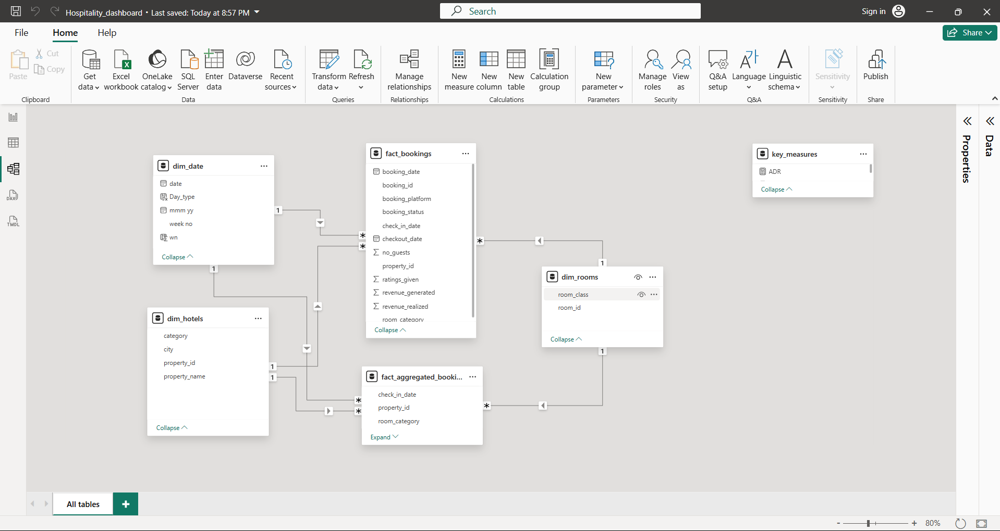
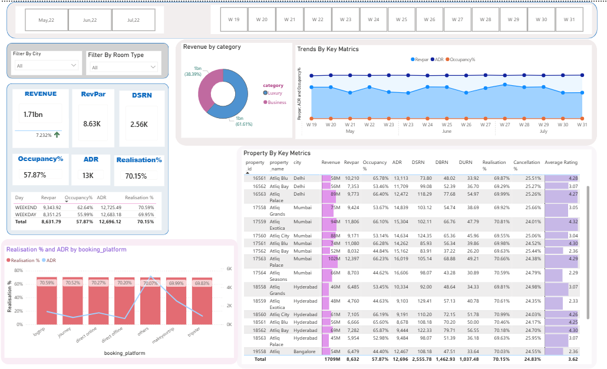

# Hospitality Revenue Analysis Dashboard | Power BI

## Project Overview

This project focuses on analyzing hotel performance and revenue trends using Power BI. The dashboard provides actionable insights into occupancy, revenue generation, booking behavior, customer ratings, and operational efficiency across multiple hotel properties and cities.

The objective was to transform raw hospitality booking data into meaningful business insights through data modeling, DAX calculations, and interactive visualizations.

---

## Business Problem

Hotel management requires a centralized reporting solution to:

- Monitor overall revenue performance
- Track occupancy and room utilization
- Analyze booking platform contributions
- Measure cancellation and no-show rates
- Compare hotel properties across cities
- Evaluate customer satisfaction through ratings
- Monitor week-over-week business performance

---

## Dataset Description

The project uses a Star Schema data model consisting of:

### Fact Tables

#### fact_bookings
Contains booking-level transactional data including:

- Booking ID
- Booking Date
- Check-in Date
- Check-out Date
- Booking Platform
- Booking Status
- Revenue Generated
- Revenue Realized
- Ratings Given
- Number of Guests

#### fact_aggregated_bookings
Contains aggregated operational metrics:

- Property ID
- Room Category
- Capacity
- Successful Bookings

---

### Dimension Tables

#### dim_hotels

- Property ID
- Property Name
- City
- Category

#### dim_rooms

- Room ID
- Room Class

#### dim_date

- Date
- Month-Year
- Week Number
- Day Type (Weekday/Weekend)

---

## Data Modeling

A Star Schema approach was implemented to establish efficient relationships between fact and dimension tables.
## Data Model

### Relationship Structure

- dim_date → fact tables
- dim_hotels → fact tables
- dim_rooms → fact tables

The data model enables efficient filtering, aggregation, and KPI calculations throughout the dashboard.

---

## Data Preparation

The following preprocessing steps were performed:

- Connected and validated relationships between tables
- Organized fact and dimension tables
- Cleaned and standardized data formats
- Created calculated measures using DAX
- Applied percentage and numeric formatting
- Built dedicated measures table for KPI management

---

## Key Performance Indicators (KPIs)

### Revenue Metrics

- Revenue
- Revenue WoW Change %
- RevPAR
- RevPAR WoW Change %

### Occupancy Metrics

- Occupancy %
- Occupancy WoW Change %

### Operational Metrics

- ADR (Average Daily Rate)
- ADR WoW Change %
- DSRN
- DSRN WoW Change %
- DBRN
- DURN

### Customer Metrics

- Average Rating
- Realisation %
- Realisation WoW Change %
- Cancellation %
- No Show Rate %

### Booking Metrics

-    Total Bookings
- Total Successful Bookings
-  Total Cancelled Bookings
- Total Checked Out
- Total No Show Bookings
- Booking % by Platform

---

## Dashboard Features

### Interactive Filters

- City Filter
- Room Type Filter
- Month-Year Slicer
- Week Number Slicer

### Visualizations

#### KPI Cards

- Revenue
- RevPAR
- DSRN
- Occupancy %
- ADR
- Realisation %

#### Revenue Analysis

- Revenue by Category (Luxury vs Business)

#### Trend Analysis

- Revenue Trend
- RevPAR Trend
- ADR Trend
- Occupancy Trend

#### Booking Platform Analysis

- Realisation % by Booking Platform
- ADR by Booking Platform

#### Property Performance Matrix

Detailed comparison of:

- Revenue
- RevPAR
- Occupancy
- ADR
- DSRN
- DBRN
- DURN
- Realisation %
- Cancellation %
- Average Rating

---

## Advanced Power BI Features Used

- DAX Measures
- Conditional Formatting
- Custom Tooltips
- KPI Indicators
- Week-over-Week Analysis
- Data Modeling
- Interactive Slicers
- Custom Visual Formatting
- Dynamic Filtering
- Bar-in-Cell Visualization
- Relationship Management

---

## Key Business Insights

- Revenue performance can be analyzed across hotel categories and properties.
- Occupancy and ADR trends help evaluate operational efficiency.
- Booking platform analysis highlights channel effectiveness.
- Cancellation and no-show metrics reveal potential revenue leakage.
- Customer ratings provide visibility into guest satisfaction.
- Week-over-Week metrics support trend monitoring and business decision-making.

---

## Project Files

| File | Description |
|--------|------------|
| Hospitality_Dashboard.pbix | Power BI Dashboard File |
| dashboard.png | Dashboard Screenshot |
| DAX_Measures.xlsx | DAX Measures Documentation |
| Hospitality_Data_Dictionary.txt | Metadata & Column Definitions |
| Dataset Files | Source Data Tables |

---

## Tools & Technologies

- Power BI Desktop
- DAX (Data Analysis Expressions)
- Power Query
- Data Modeling
- Microsoft Excel

---

## Skills Demonstrated

- Business Intelligence
- Data Visualization
- Data Analysis
- Data Modeling
- KPI Development
- Dashboard Design
- DAX Programming
- Power Query
- Hospitality Analytics
- Reporting & Documentation

---

## Dashboard Preview

---

## Author

ANIKET DHAR

Power BI | Data Analytics | Business Intelligence
